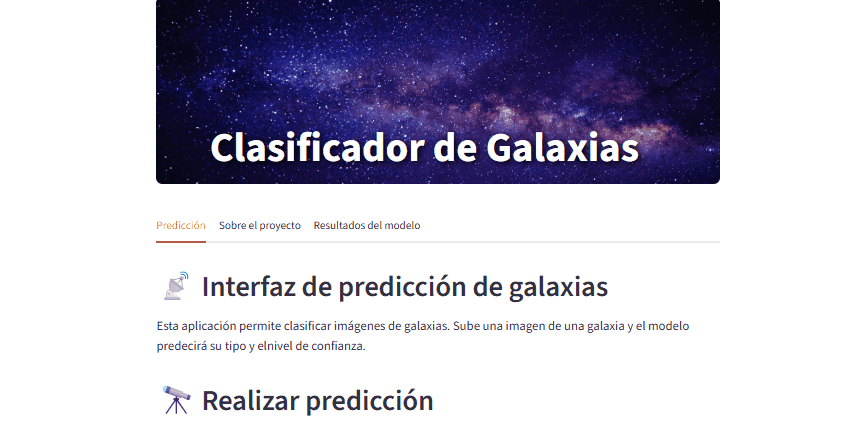
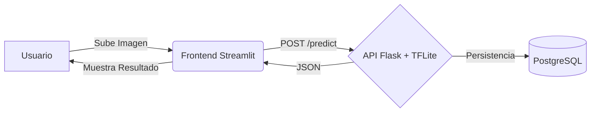

# 🌌 Galaxy Classifier: Deep Learning End-to-End Pipeline


> **Proof of Concept (PoC) sobre la productivización de modelos de Deep Learning: desde el entrenamiento hasta el despliegue cloud con persistencia.**

---

## 📋 Resumen del Proyecto

**Galaxy Classifier** es una implementación completa de un sistema de clasificación morfológica de galaxias utilizando el dataset **Galaxy10 DECaLS**.

El **objetivo principal** es demostrar un flujo de trabajo de MLOps robusto y reproducible, que abarca:

1.  Entrenamiento y validación de un modelo de Deep Learning (CNN).
2.  Desarrollo de una API RESTful para servir el modelo.
3.  Orquestación de servicios mediante Docker.
4.  Despliegue en la nube con persistencia de datos y trazabilidad.

🔹 **Nota:** Se prioriza la calidad del código, la trazabilidad, la reproducibilidad del entorno y la arquitectura de microservicios sobre la métrica pura del modelo.

---

## 📸 Demo End-to-End

_(Demostración del flujo completo: Carga de imagen -> Inferencia -> Persistencia -> Resultado)_



---

## 🏗️ Arquitectura y Pipeline

El sistema sigue un flujo de datos desacoplado diseñado para producción:



### Stack Tecnológico

- **Frontend:** Streamlit (Interfaz reactiva para interacción usuario/modelo).
- **Backend:** Flask servido con Gunicorn.
- **AI Core:** EfficientNetB0 optimizado a TensorFlow Lite.
- **Persistencia:** PostgreSQL (Registro de auditoría de predicciones).
- **Infraestructura:** Docker & Docker Compose.

---

## 🧠 El Modelo: Arquitectura y Entrenamiento

Se utilizó Transfer Learning sobre la arquitectura **EfficientNetB0**.

- **Dataset:** Galaxy10 DECaLS (~18.000 imágenes, 10 clases).
- **Preprocesamiento:**

  - Resize (224x224).
  - Normalización y Data Augmentation (rotaciones, zoom, flips).
  - Balanceo de clases (Undersampling/Oversampling).

- **Configuración de la Red:**

  - Últimas 100 capas descongeladas para fine-tuning.
  - Top: FC 256 -> 128 -> 64 (ReLU) -> Softmax (10 clases).
  - Optimizador: Adam (1e-5).

- **Ingeniería de Optimización (Recursos Limitados):**
  - Se implementó un pipeline de conversión a **TensorFlow Lite** para reducir el peso del modelo (~50MB) y el consumo de RAM, permitiendo el despliegue en entornos restringidos sin perder precisión significativa.

---

## 📂 Estructura del Repositorio

```bash
galaxy-classifier/
├── docker-compose.yml      # Orquestación de servicios (Recomendado)
├── Dockerfile              # Definición del contenedor API (Backend)
├── src/
│   ├── api/                # Lógica del Backend
│   │   └── app.py          # Endpoints REST
│   ├── database/           # Capa de Datos
│   │   ├── models.py       # Modelos SQLAlchemy (Schema)
│   │   └── db.py           # Conector
│   ├── frontend/           # Capa de Presentación
│   │   ├── ui.py           # Aplicación Streamlit
│   │   └── Dockerfile      # Contenedor UI
│   └── models/             # Artefactos de IA
│       └── modelo_galaxias.tflite  # Modelo productivo
├── notebooks/              # Entrenamiento y conversión
├── docs/                   # Documentación y assets
└── requirements.txt        # Dependencias (TF-CPU fijado)

```

---

## 🛠️ Instalación y Ejecución

Se ofrecen dos métodos de ejecución. Se recomienda **Docker Compose** para garantizar la reproducibilidad del entorno.

### Opción A: Docker Compose (Recomendada)

Replica exactamente la infraestructura de producción.

1. **Clonar y construir:**

```bash
git clone [https://github.com/rizzijp/galaxy-classifier.git](https://github.com/rizzijp/galaxy-classifier.git)
cd galaxy-classifier
docker-compose up --build

```

2. **Acceder:**

- 🖥️ Frontend: [http://localhost:8501](https://www.google.com/search?q=http://localhost:8501)
- ⚙️ API: [http://localhost:10000](https://www.google.com/search?q=http://localhost:10000)

Nota: Para detener la aplicación y limpiar los volúmenes de base de datos, usa docker-compose down -v.

### Opción B: Ejecución Python Local (Entorno Virtual)

Requiere PostgreSQL instalado localmente o acceso remoto.

1. **Configurar entorno:**

```bash
python -m venv .venv
source .venv/bin/activate  # Windows: .venv\Scripts\activate
pip install -r requirements.txt

```

2. **Variables de Entorno:**

- Crea `.env` y configura tus credenciales de BD.

3. **Ejecutar:**

- Lanza la API y el Frontend en terminales separadas.

---

## 📡 Documentación de la API

La API RESTful gestiona la inferencia y la base de datos. Todos los endpoints retornan JSON.

| Método   | Endpoint              | Descripción                                            |
| -------- | --------------------- | ------------------------------------------------------ |
| `POST`   | `/predict`            | Recibe imagen, valida, infiere y guarda el resultado.  |
| `GET`    | `/predictions`        | Lista el historial de predicciones.                    |
| `GET`    | `/predictions/<id>`   | Consulta detalle de una predicción.                    |
| `DELETE` | `/predictions/delete` | Limpia registros (Admin).                              |
| `POST`   | `/reset_db`           | **Dev Only.** Regenera el esquema de la base de datos. |
| `GET`    | `/health`             | Healthcheck del servicio.                              |

**Ejemplo de Respuesta (`POST /predict`):**

```json
{
  "predictions": [
    {
      "id": 123,
      "filename": "galaxy_sample.jpg",
      "prediction": "Spiral",
      "confidence": 0.87,
      "timestamp": "2025-12-01T18:30:00Z"
    }
  ]
}
```

---

## 👥 Autores

Equipo de desarrollo del proyecto Galaxy Classifier:

- **Álvaro Martínez**
- **Juan Pablo Rizzi**
- **Rocío Ortiz**
- **José Benegas**
- **Sara Gil**

---
